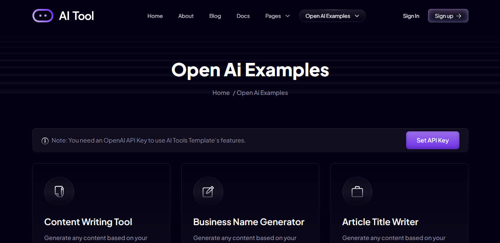
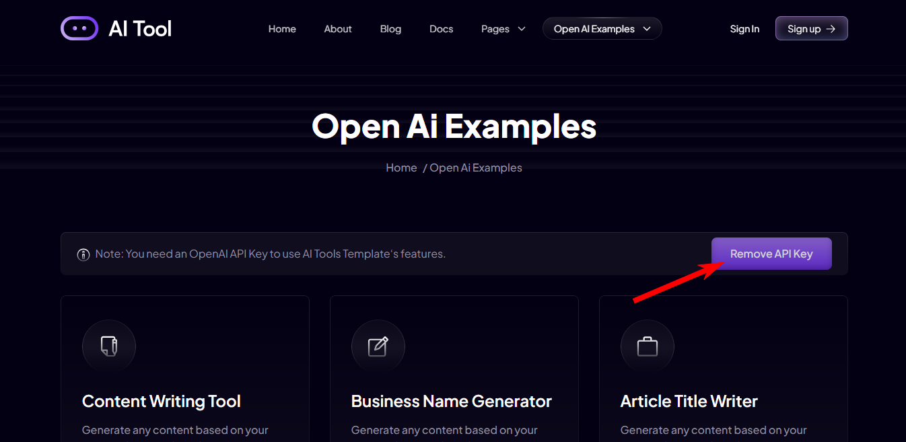

# OpenAI Next.js SaaS Starter Kit and Boilerplate

AI Tool is a SaaS boilerplate and **starter kit built with OpenAI and Next.js** for creative minds looking to build AI-driven SaaS applications. This starter kit simplifies the process of launching your AI startup by providing pre-configured settings and pre-built OpenAI examples, integrations, essential components, SaaS business pages, and functionalities.

[](https://nextjstemplates.com/templates/ai-tool)

This OpenAI + Next.js Starter Kit isn't just a template - it's a complete package that can jump-start your AI project. It includes everything you need for a quick AI product launch, from AI features to basic business pages and integrations.

### [🔥 Download Now](https://nextjstemplates.com/templates/ai-tool)

### [🚀 Live Demo](https://ai-tool.nextjstemplates.com/)

### [🤖 Installation and Configuration Docs](https://nextjstemplates.com/docs/templates#ai-tool)

## OpenAI Starter | AI Tool - Core Features


**Based on the latest technologies:** It uses Next.js 13, React 18, and TypeScript to deliver fast loading times, server-side rendering, and dynamic routing, ensuring optimal performance and functionality.

**Easy OpenAI Integration:** Includes pre-configured and OpenAI pre-built examples, making it easier to get your AI startup up and running quickly. To make all AI functionality work, simply enter your API key.


**Ready-to-Use OpenAI Examples:** Six ready-to-use interactive OpenAI examples that you can try on the demo template and even use in production.


**High-quality Design:** Carefully crafted with a keen focus on modern design trends, best practices, and an exceptional user experience.

**Sanity Blog Integration:** Use the power of Sanity CMS to easily manage and create blog content. With a simple and easy-to-use blog management system, you can keep your audience engaged and informed.

**PostgreSQL DB Integration:** With built-in database integration, Vercel's PostgreSQL database provides enhanced performance, scalability, and dependability.

**Stripe Subscription Payment Integration:** With Stripe integration, you can easily monetize your AI tool startup platform. Allow users to make secure and convenient online payments by providing subscription-based services and products.

**Seamless Authentication with NextAuth:** Using NextAuth, we've implemented secure login functionality, allowing users to securely authenticate and access your application.

**MDX Docs Support:** Built-in MDX to Docs Portal System, allowing you to create your own docs portal for end users.


**SEO and Performance Optimized:** Means it loads fast, runs smoothly, adheres to SEO practices, and enhances user experience. It may include features like mobile responsiveness, quick load times, efficient coding, and compatibility with different browsers and devices.

**Effortless Deployment:** Easily deploy your on platforms such as Vercel, Netlify, or AWS, ensuring a confident and seamless launch.

**Rich Documentation:** At each step, detailed explanations are provided to ensure that you understand the purpose and functionality of each component and configuration. This can range from integrating with OpenAI and the PostgreSQL database to Auth to setting up Stripe for subscription payments and deploying your startup on platforms such as Vercel, Netlify, or AWS.

For testing the demo you have to add the api-key.

- Got to /ai-examples
- Click on the **Set API Key** button



And save it.

Once you are done testing you can remove the key from here:



### For Developement and Production

For developement or production you have to save the Api-Key on the .env file with the follwing name

```
OPENAI_API_KEY=YOUR_API_KEY
```


## Installation and Configuration

You must follow the documentation setp by step in this order to do a successful installation and configuration. 

### [AI Tool Installation and Config Docs](https://nextjstemplates.com/docs/templates#ai-tool)

1. [Installation](#installation)
2. [Authentication](https://nextjstemplates.com/docs/authentication)
3. [Database Setup - PostgreSQL on Vercel](https://nextjstemplates.com/docs/database#postgresql-on-vercel)
4. [Sanity Integration](https://nextjstemplates.com/docs/sanity)
5. [Markdown Integration](https://nextjstemplates.com/docs/markdown)
6. [Stripe Integration](https://nextjstemplates.com/docs/stripe)
